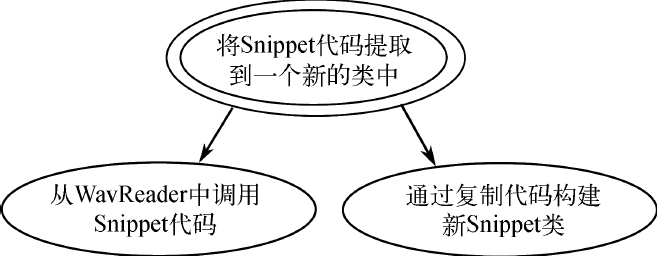

# 遗留代码的挑战

- [遗留代码的挑战](#遗留代码的挑战)
  - [遗留代码](#遗留代码)
  - [法则](#法则)
  - [遗留应用程序](#遗留应用程序)
  - [保持测试驱动开发的心态](#保持测试驱动开发的心态)
  - [支持测试的安全重构](#支持测试的安全重构)
  - [添加测试刻画已有行为](#添加测试刻画已有行为)
  - [被遗留代码转移注意力](#被遗留代码转移注意力)
  - [为 rlog 创建测试替身](#为-rlog-创建测试替身)
  - [测试驱动开发改动](#测试驱动开发改动)
  - [新的场景](#新的场景)
  - [寻求更快测试的简要探索](#寻求更快测试的简要探索)
  - [立竿见影的提取](#立竿见影的提取)
  - [用成员变量查看状态](#用成员变量查看状态)
  - [用 mock 查看状态](#用-mock-查看状态)
  - [用 Mikado 方法大规模改动代码](#用-mikado-方法大规模改动代码)
  - [Mikado 方法概览](#mikado-方法概览)
  - [用 Mikado 移动一个方法](#用-mikado-移动一个方法)

大部分时间我们需要处理的是遗留了许久的代码，并且很大可能这些代码并没有使用 TDD 的遗留代码，本章的主要内容围绕如何处理这些遗留代码：

- 在没有测试的情况下安全地重构代码的技巧和思路。
- 向已有代码中加入一些测试来描述它们的行为特征，以便测试开发任何所需的改动。
- 样使用链接器存根，以快速摆脱第三方库经常对测试造成的令人头痛的问题。
- 管理大规模代码重构的技巧 ———— Mikado 方法。

## 遗留代码

针对遗留代码的态度，是选择让维护成本不断增加（再函数内增加各种各样的标志和内嵌的代码块）或者着手处理问题？或许大多数时候还是值得一拼的，不允许任何人让系统变得更糟。不值得这么做的唯一情况是，你面对的是一个封闭的系统或即将被淘汰的系统。

## 法则

处理遗留代码问题的核心法则：

1. **任何时候，只要可以就进行测试驱动**。使用测试驱动方法时，有可能的话就将需要改动的代码作为新的成员或新的类。
2. **不要让测试覆盖率缩水**。非常容易出现的情况是，改动一点代码，然后认为这只是一些简单的代码行，并对之不予过多考虑。如果没有测试，每一行新加的代码都会导致测试覆盖率降低。
3. **为了编写测试，必须改动现有代码！**由于对协作对象的依赖，大多数情况下不能方便地为遗留代码编写测试。在编写测试前，需要一个打破依赖的方法。
4. **可以在限制范围内实施微小的代码改动，这样会降低风险**。用一些技巧就可以手动地做出一些小而安全的代码变换。
5. **仔细斟酌再遗留代码上所作的修改**。你编写的每行代码都有风险，甚至一个敲错的字符都会引入潜在的缺陷，而这可能会浪费好几个小时。尽可能少写代码，每敲击一次键盘时都要想清楚。
6. **坚持小的、增量的改动**。这在TDD中是奏效的。同样，对遗留代码也是如此。步子迈得太大会使你陷入困境。
7. **一次只做一件事**。在处理遗留代码时，不要合并步骤或目标。例如，不要在重构的同时写测试。
8. **有些增量的改动可能会使代码变得丑陋，要接受这一点**。记住，一次只做一件事。可能需要几个小时做“正确”的事。不要等，现在就提交工作方案，因为这样或许就不用花费过多时间。最终，你可能要抽出时间回过头来整理代码，或许你不会，但依然是进步了。你已经向正确的方向迈进了，而且也证明了所有代码依然可以工作。
9. **增量地修改代码**。面对庞大的代码库时，仅仅为遇到的相关代码编写测试或许不能带来巨大改观。更重要的是你内心深知任何新加入的东西都需要经过测试。

秉承测试第一的心态，你会开始从加入的测试中获益。每通过一个测试，可以回顾一下测试覆盖的代码区域。几乎总能发现做一些小的、安全的重构工作的机会。同时，你也会发现在写完一个测试后，再写一个是如此容易。你可以在各个地方应用这种小的改善步伐而丝毫不影响产出，也将在困难重重的代码库中如履平地。

## 遗留应用程序

本章将以以下遗留的应用程序为例：

场景: WAV Snippet Publisher
> 为一个内容转销商，我想要 WAV Snippet Publisher 从一个源文件目录下的每个 WAV 文件中抽出一段，然后生成一个新的 WAV 文件，并保存在目标目录下。

客户不断提出新的需求：

场景：添加多通道的支持
> 目前，Snippet publisher 仅能处理单通道 WAV 文件。作为内容转销商，要确保立体声效的 WAV 片段不会被中途截断。

由于 Snippet publisher 并没有使用 TDD，以及其几乎没有单元测试，因此修改其时个巨大的挑战，风险也非常高。

## 保持测试驱动开发的心态

在应对遗留代码时依然是测试先行。即使已经编写完测试所涵盖的代码，仍需要写测试来描述已有行为的特征。同时，也要以 TDD 的方式添加新代码。

只需要测试即将被改动的代码，参考底线会告诉你什么时候破坏了已有的行为。虽然你要判定出哪些依赖代码可能会因此被破坏，但不需要测试超出改动范围的代码。

同时，要避免那些必须与文件系统直接打交道的测试，以便保持测试集快速运行并减少管理文件的烦恼。尽量使用存储于内存的流而非文件流，这样可以部分达成效果。

## 支持测试的安全重构

为了开始对多通道的支持，先找出 open() 函数中有用的功能验证点:[源码路径](https://github.com/HATTER-LONG/TDD_Learning/blob/master/Src/SnippetPublisher/WavReader.cpp)。

根据需求需要支持多通道，发现函数末尾的一段功能代码 —— 总秒数、要写出的采样数目、开始的地方，等等。紧接着计算的是一个for循环，看上去要将采样写入输出文件中，需要修改一些地方支持多通道。

在修改前可以为其编写一些测试，但是如果再 open() 函数中，想要测试到达这部分代码需要许多前期准备。

**与之相反，将循环代码隔离出来（目标代码），放入一个成员函数中，然后直接测试即可。**

P171 查看抽离细节。

至此提取出 writeSamples() 函数，并增强了 open() 函数的抽象度。

## 添加测试刻画已有行为

当我们需要改动 writeSamples() 函数时，从编写测试开始吧！这时就可以开始通过 TDD 来编写我们所需的功能。

## 被遗留代码转移注意力

再本例中有一些第三方库，会为测试制造许多困难。它们要么速度慢，要么需要大量的配置工作，还可能有副作用。如果你是第一次面对遗留代码，很有可能会花费大量时间以处理来自第三方库导致的类似问题。

规避第三方库的一个可行方法是链接替换。就 WavReader 应用而言，我们将创建一个包含存根函数的库，这些函数对应 rlog 中的每个函数，在构建应用可执行文件时，我们会链接到这个库。

链接替换，或链接期替换，听上去比做起来难得多，但其实可以很快建立。

## 为 rlog 创建测试替身

不需要为 rlog 库中定义的每个函数生成存根函数，只需要定义测试需要的。

1. 首先注释掉 makefile 中 rlog 库的链接命令： `#target_link_libraries(utest rlog)`；
2. 接下来尝试构建项目，会发现很多与 rlog 有关的链接错误；
3. 接下来需要为链接到 rlog 的每个函数提供存根。
4. 接下来将存根编译成一个 rlogStub 的替换库，替换掉原来的 rlog。

- 为程序链接所需的 rlog 函数生成存根的方法：
  1. 将 rlog 的头文件复制进一个子目录，将其重命名为一个 .cpp 文件。
  2. 编辑这个.cpp文件，如果需要返回一个默认的返回值，那么就可以将函数原型变为一个存根了。
  3. 编译并重复上述两个步骤，直到消除所有的链接错误。

以 StdioNode 类举例：

```cpp
#include <rlog/StdioNode.h>
class RLogNode;
class RLogData;
using namespace std;
namespace rlog {
    StdioNode::StdioNode(int _fdOut, int flags)
       : RLogNode() {}
    StdioNode::StdioNode(int _fdOut, bool colorizeIfTTY)
       : RLogNode(), fdOut( _fdOut ) { }
    StdioNode::~StdioNode() { }
    void StdioNode::subscribeTo( RLogNode *node ) { }
    void StdioNode::publish( const RLogData &data ) { }
}
```

- 转换头文件需要考虑的事情：
  1. 首先需要做的是，包含所创建的实现文件的地方头文件。
  2. 可能需要将实现文件放在一个命名空间中。
  3. 移除 virtual 和 static 关键字。
  4. 移除 public: 和其他一些访问修饰符。
  5. 移除成员变量和枚举值。
  6. 在移除预处理定义和 typedefs 时要小心。
  7. 如果函数有返回值，就返回一个最简单的，如 0、false、""、空指针或一个无参构造函数构造的实例。
  8. 如果必须要返回一个 const 引用，创建一个全局变量，并返回这个变量。
  9. 不要忘记将函数限定在合适的类。
  10. 不要太注重外观，重要的是能够编译。

- 接下来在 Makefile 中替换掉 rlog 的链接：`target_link_libraries(rlogStub pthread)`

可能还有一些其他链接问题，只需要按照上述步骤解决即可。

## 测试驱动开发改动

这里书中以修改 open 用于支持多通道举例，与之前学习到的测试驱动开发无太大差异，因此略过。

## 新的场景

场景：增强描述符

>背景：open() 函数的倒数第二步是发送消息至 WavDescriptor 对象，该对象的工作是将格式化的记录追加至描述符文件。WAV 发布商的用户界面用这个描述符文件中的内容来显示可用的 WAV 文件。这个描述符接收 WAV 文件名、（剪辑前的）总时间、每秒的采样数以及通道的数目。
>场景：作为内容转销商，我想要WAV文件中的描述符也包括新的剪辑文件长度。修改描述符对象使其接受文件长度。

加入新的功能时，最好先将其作为一个新的方法，甚至一个新的类。这将确保代码的测试覆盖率不会因为代码库的增长而降低。同时，也有助于恪守单一责任原则，并且从小方法和类中受益。

但是新增的功能往往面临一个问题就是需要调用一些原因，例如需要与文件系统交互最终导致测试运行很慢。

在TDD过程中，你有可能最终只能得到少数几个运行慢的测试。或许这没什么问题，但要努力使这样的测试减少，尽量降至零。更重要的是，标出这些慢速的测试，并确保能够找到一种运行快速、慢速，或者同时运行快速和慢速测试集的方法。

## 寻求更快测试的简要探索

当前的应用程序中只有一个慢速测试，我们应尽量减少慢速的测试，一旦放任不管，慢速测试数量很快多起来。

一个可行的方案是将部分只处理音频流的功能独立出来，并测试驱动开发它。对于 size() 函数，我们甚至可以创建更小的方法。

```cpp
//wav/12/FileUtilTest.cpp
streamsize size = util.execute(TempFileName,
    [&](istream& s) { return StreamUtil::size(s); });
//wav/12/FileUtil.h
std::streamsize execute(
const std::string& name,
std::function<std::streamsize (std::istream&)> func) {
    std::ifstream stream{name, std::ios::in | std::ios::binary};
    return func(stream);
}
```

对于我们将要面对的其他遗留代码往往也可以采用此方法。

## 立竿见影的提取

重构的目的往往是需要得出一些可以存根或模拟的函数，可以将一个大的函数切割提取出来，使得单元测试的推进更加容易。

如书中举例整理 wav 程序 open() 接口。

## 用成员变量查看状态

有时遇到需要判断成员变量状态来达成测试的目的，书中举例便是将私有的成员置入 public 中，使得测试可以直接访问不应对外可见的成员变量。

有时为了能够把控遗留代码，我们需要做些弄脏代码的事情。要提醒自己进一步改动代码，若不知道是否会破坏一些功能，则会把代码弄得更脏。

## 用 mock 查看状态

可以将一些调用接口使用 MOCK 替换掉，这样直接 Expect_Call 就可以判断调用关系以及参数了。

具体使用方式可以参照书中本节。

## 用 Mikado 方法大规模改动代码

## Mikado 方法概览

完整的过程要经历看上去令人却步的9个步骤。然而，一旦经历过几次后，你会感到这再自然不过了。习惯该方法甚至比习惯TDD步骤还要快。

1. 制定 Mikado 目标以及想要达到的最终状态。
2. 以最稚拙的方法实现这一目标。
3. 找出所有的错误。
4. 找到解决错误的即时方案。
5. 将即时方案作为新的前提目标。
6. 如果有错误，将相应的代码回滚到最初状态。
7. 对每个方案重复步骤2至步骤6。
8. 检查代码是否存在错误；将前提目标标记为完成。
9. 完成了Mikado目标吗？如果是，任务完成！

做大规模重构工作的大部分时间最终并不是花在实际的代码改动本身。通常来说，每个改动都很小（虽然改动很多）。相反，大部分时间花在必要条件分析和自我思索上。“调用这个函数的所有客户代码在哪？如果改动它们，还有哪些客户代码会受到影响？代码到底做了什么？我要怎样证明代码依然工作？”

你可以用 Mikado 方法将分析和基于分析改动代码的时间相分离。可以将代码改动约简为简单的改动图，或 Mikado 图，即一些脚本。这个图用于描绘主目标，即 Mikado 目标，以及主目标所依赖的一系列其他目标。通常而言，将图中改动的元素依次应用到代码库中。这个动作能让你以高度的自信快速、正确地改动代码。
通过建立 Mikado 图，你可以对必须要完成的任务形成可视化的总结，还可以将这些任务分发给团队成员以加速达成 Mikado 目标。Mikado 图为团队间的沟通和协作提供了一个中心点。

## 用 Mikado 移动一个方法

我们可以将 WAV 片段或 WAV 片段写出器（snippet writer）作为独立的抽象。主类 WavReader 的名字已经表明，此类中的任何写出片段都不是其职责。此外，我们正在大量地修改片段逻辑，并想将这些改动局限于更小的类范围。

作为短期的 Mikado 目标，我们要将 writeSnippet() 提取为一个类，即 Snippet。一旦完成这个即时目标，我们便计划相应地整理 Snippet 代码。但是，每次只集中一个目标。

作为 Mikado 方法的第一步，我们用同心的双椭圆表示最终目标。我们倾向于将一个大的白板作为工具。因为我们希望每个人都能看到 Mikado 图，所以需要大量的空间，在修改代码的过程中，我们会增量地构建这个图。


根据 Mikado 方法的第二步，我们以最稚拙的方法直奔目标。将 writeSnippet() 函数移至（剪切并粘贴）一个新文件 Snippet.h 中，并将其放入一个类定义中。

> wav/17/Snippet.h

接下来在 WavReader 中创建 Snippet 对象，调用其 writeSnippet() 成员函数。

> wav/17/WavReader.cpp

```cpp
#include "Snippet.h"
// ...
void WavReader::open(const std::string& name, bool trace) {
    // ...
    auto data = readData(file, dataChunk.length); // 泄漏！
➤  Snippet snippet;
➤  snippet.writeSnippet(name, file, out, formatSubchunk, dataChunk, data);
}
```

进行编译（Mikado方法的第三步：找出所有的错误）。快速检查编译错误发现，因为在 Snippet.h 中漏掉了一些定义，所以调用 writeSnippet() 的代码无法编译。

为了完成 Mikado 目标，我们需要完成两个前提任务（Mikado 方法的第四步：找到解决错误的即时方案）：

1. 粘贴代码以便得到一个新Snippet类；
2. 修改 WavReader 以便使用 Snippet 对象（我们已经尝试了修改代码）。

将此改进作为前提更新进Mikado图（Mikado方法的第五步：将即时方案作为新的前提目标）。



接下来，先不处理从 WavReader 中调用 Snippet 代码。集中精力创建 Snippet 类。而这里就到了 mikado 方法最有趣的第六步，因为有错误，所以我们回滚代码改动。我们已经得到了分析结果，并标记在了Mikado图中，一旦知道要做什么，真正改动代码不会花费太长时间

`git reset —hard && git clean -f`

现在要做的是，判断通过复制代码而创建新的 Snippet 类是否为叶节点。第一次尝试基本和之前写的代码一样：将 writeSnippet() 复制到 Snippet.h，把它放进类定义中，从声明中移除 WavReader::。为了让编译器找到 Snippet.h，在 WavReader 中加入 #include。

选择可能失败的简单目标看起来再做无用功，但是这使我们避免再没有任何具体反馈前没完没了的进行分析，并且有助于 Mikado 图勾勒更小的子步骤。

具体还是看书吧。

